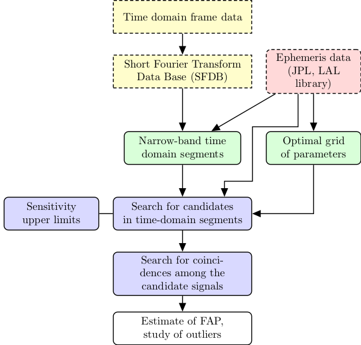

# Polgraw all-sky pipeline: search for almost monochromatic gravitational wave signals 

This is the documentation of a gravitational-wave search pipeline of the [Polgraw](https://polgraw.camk.edu.pl/en) group. 

#### Pipeline flowchart  

##

#### Topics

1. [Input data generation](input_data.md) 
2. [F-statistic candidate signal search](search_for_candidates.md)
3. [Coincidences between candidates](coincidences.md)
4. [False alarm probability of coincidences](fap_coincidences.md) 
5. [Followup of interesting outliers](followup.md)
6. [Pipeline: a minimal example](pipeline_script.md)
7. [Documents and publications](articles.md)

#### Contributors 

In alphabetic order:

* Michał Bejger
* Jan Bolek
* Paweł Ciecieląg
* Orest Dorosh
* Aleksander Garus
* Andrzej Królak
* Maciej Piętka
* Gevorg Poghosyan
* Magdalena Sieniawska 
* Rafał Skrzypiec
